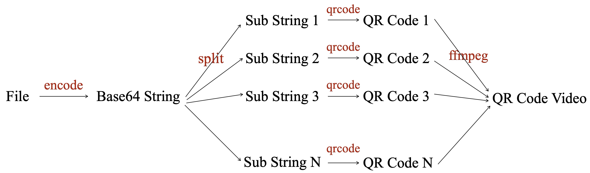

# Introduction

FileQrcoder is a basic tool used to convert a file in any format into a list of QRCode images. *Additionally, it also supports encrypting files and then converting them into QRCodes.*

# Quick Show

This quick show demonstrates how the file ***'fileqrcoder.py'*** is first encoded into multiple QR codes stored in ***'qrcodes/'***, then decoded into individual JSON reports in ***'reports/'***, which are merged into ***'merged_report.json'***, and finally used to perfectly reconstruct the original file as ***'out.txt'*** which is identical to ***'fileqrcoder.py'***, completing the full encoding-to-reconstruction pipeline with data integrity verification at each stage.

```shell
export DYLD_LIBRARY_PATH=/opt/homebrew/lib/
cd FileQrcoder/

# 1. encode: 'fileqrcoder.py' -> 'qrcodes/'
python3 fileqrcoder.py encode --infile fileqrcoder.py --outdir qrcodes/

# 2. decode: 'qrcodes/' -> 'reports/'
python3 fileqrcoder.py decode --indir qrcodes/ --outdir reports

# 3. merge: 'reports/' -> 'merged_report.json'
python3 fileqrcoder.py merge --indir reports/ --outfile merged_report.json

# 4. recover: 'merged_report.json' -> 'out.txt'
python3 fileqrcoder.py recover --report merged_report.json --outfile out.txt

# 5. check if 'out.txt' is identical to 'fileqrcoder'
```

# Quick Show (video version)

This demonstration showcases a complete file-to-QR-video conversion system using ***'fileqrcoder.py'*** as an example. The encoding process first converts the file into multiple QR code images stored in ***'qrcodes/'*** directory, then compiles them into ***'a.mp4'*** video. For decoding, the system extracts video frames into ***'frames/'***, decodes them into JSON reports in ***'reports/'***, merges these into ***'merged_report.json'***, and finally reconstructs the original file as ***'out.txt'*** which is identical to ***'fileqrcoder.py'***, demonstrating a perfect bidirectional conversion cycle that maintains complete data integrity throughout all transformation stages.

```shell
export DYLD_LIBRARY_PATH=/opt/homebrew/lib/
cd FileQrcoder/

# 1. encode: 'fileqrcoder.py' -> 'qrcodes/'
python3 fileqrcoder.py encode --infile fileqrcoder.py --outdir qrcodes/

# 2. image2video: 'qrcodes/' -> 'a.mp4'
python3 fileqrcoder.py image2video --indir qrcodes --outfile a.mp4

# 3. video2image: 'a.mp4' -> 'frames/'
python3 fileqrcoder.py video2image --infile a.mp4 --outdir frames

# 4. decode: 'frames/' -> 'reports/'
python3 fileqrcoder.py decode --indir frames/ --outdir reports

# 5. merge: 'reports/' -> 'merged_report.json'
python3 fileqrcoder.py merge --indir reports/ --outfile merged_report.json

# 6. recover: 'merged_report.json' -> 'out.txt'
python3 fileqrcoder.py recover --report merged_report.json --outfile out.txt

# 7. check if 'out.txt' is identical to 'fileqrcoder'
```

# More Usage

## Encode

```shell
python3 fileqrcoder.py encode --infile fileqrcoder.py
```

## Decode

### one qrcode

```shell
python3 fileqrcoder.py decode --infile qrcode.png
```

### many qrcodes

```shell
python3 fileqrcoder.py decode --indir qrcodes
```

## Merge

```shell
python3 fileqrcoder.py merge --indir report_20250719155714 # => report_xxx.json
```

## Recover

```shell
python3 fileqrcoder.py recover --report merged_report.json --outfile out.txt
```

## Images to Video

```shell
python3 fileqrcoder.py image2video --indir qrcodes --outfile a.mp4
```

## Video to Images

```shell
python3 fileqrcoder.py video2image --infile a.mp4 --outdir frames
```

## Video to Audio

```shell
python3 fileqrcoder.py video2audio --infile A.mp4
```

## Add Audio to A Slient Video
```shell
python3 fileqrcoder.py addaudio --video a.mp4 --audio out.aac --outfile out.mp4
```

## Concat Image

```shell
python3 fileqrcoder.py encode --infile fileqrcoder.py

 python3 fileqrcoder.py concatimage --indir qrcodes --rows 2 --cols 2 --outdir concat/
```

## Split Image

```shell
python3 fileqrcoder.py splitimage --indir concat/ --rows 2 --cols 2 --outdir split/
```

## Flip Image

```shell
python3 fileqrcoder.py flipimage --infile qrcode.png --direction horizontal --outfile qrcode.flip.png
```

## Image2GIF

```shell
python3 fileqrcoder.py image2gif --indir qrcodes/ --outfile a.gif
```

# Video Version

<div align="center">
  
</div>

# Old Intro

# Requirements

| Num |     target     | System | Requirements                                                                          |
| :-: | :------------: | :----: | :------------------------------------------------------------------------------------ |
|  1  | test_encode.py | MacOS | ``pip install qrcode==8.0 pillow==11.1.0``                                            |
|  2  | test_decode.py | MacOS | ``brew install zar, pip install pyzbar, export DYLD_LIBRARY_PATH=/opt/homebrew/lib/`` |

## First Attempt

```shell
cd FileQrcoder/demo/
export PYTHONPATH="${PYTHONPATH}:${pwd}"

python3 test_encode.py --file ../fileqrcoder.py --sk 12345 --qrcode_version 10 # generate QR code images for file 'file_qrcoder.py'
ls -al qrcodes/
# qrcode_00000000.png
# qrcode_00000001.png
# qrcode_00000002.png
# qrcode_00000003.png


python3 demo/display_qrcodes.py # display the above QR code images
```

## Try Your File

### Image version

```shell
cd FileQrcoder/
export PYTHONPATH="${PYTHONPATH}:${pwd}"

python3 demo/test_encode.py [PATH OF YOUR FILE] # generate QR code images for 'YOUR FILE'

export DYLD_LIBRARY_PATH=/opt/homebrew/lib/ # for 'libzbar.dylib'
python3 demo/test_decode.py
```

### Video version

```shell
export DYLD_LIBRARY_PATH=/opt/homebrew/lib/

cd FileQrcoder/
export PYTHONPATH="${PYTHONPATH}:${pwd}"
cd demo/

# file -> images
python3 test_encode.py --file ../fileqrcoder.py --qrcode_version 27

# images -> video
python3 test_video_encode.py --indir qrcodes

# video -> images
python3 test_video_extract.py --infile video.MOV

# images -> file
python3 test_decode.py --indir video_result
```

# BENCHMARK

Testing conducted on: **Apple MacBook Pro (13-inch, M1, 2020)**. Specs: Apple M1 chip (8-core CPU/GPU), 16GB RAM, macOS [Sequoia, 15.3.1]

| Num | Size of input file | CPU cores | Num of QR code images | Total time |   Rate   |
| :-: | :----------------: | :-------: | :-------------------: | :--------: | :------: |
|  1  |       497KB       |     1     |          231          |  52 secs  | 76.5kbps |

# DOCKER

## BUILD DOCKER IMAGE

```shell
cd FileQrcoder/
export image=fileqrcoder:1.0
docker build -t ${image} -f Dockerfile .
```

## Manual Mode

```shell
# enter your directory
cd xxx
# start a container
docker run -it --name qrcoder --mount type=bind,source="$(pwd)",target=/base fileqrcoder:1.0

cd /root/FileQrcoder/demo
export PYTHONPATH="..":$PYTHONPATH
python3 test_encode.py

python3 test_decode.py qrcodes/
```

## Automated Mode

```shell
# MacOS
#example: test/a.txt
cd test
export target_file=a.txt target_dir=./ image=fileqrcoder
docker run -v ${target_dir}:/data ${image} sh -c 'cd /data/ && python3 /root/FileQrcoder/test_encode.py ${target_file}'
ls -al qrcodes/ # qrcodes/


# Linux
export target_file=a.txt target_dir=/root/test/ image=fileqrcoder
mkdir -p ${target_dir} && echo "Hello, this is FileQrcoder" > ${target_dir}${target_file}
docker run --mount type=bind,source=${target_dir},target=/data ${image} sh -c 'cd /data/ && python3 /root/FileQrcoder/test_encode.py ${target_file}'
```

# MORE TESTS

```shell
cd /base/FileQrcoder/demo/
export PYTHONPATH="/base/FileQrcoder/":$PYTHONPATH
python3 generate.py
python3 test_locate.py
```

# FYI

## Base64 Symbols

| Index | Char  |  | Index | Char  |  | Index | Char  |  | Index | Char  |
| ----- | ----- | - | ----- | ----- | - | ----- | ----- | - | ----- | ----- |
| 0     | `A` |  | 17    | `R` |  | 34    | `i` |  | 51    | `z` |
| 1     | `B` |  | 18    | `S` |  | 35    | `j` |  | 52    | `0` |
| 2     | `C` |  | 19    | `T` |  | 36    | `k` |  | 53    | `1` |
| 3     | `D` |  | 20    | `U` |  | 37    | `l` |  | 54    | `2` |
| 4     | `E` |  | 21    | `V` |  | 38    | `m` |  | 55    | `3` |
| 5     | `F` |  | 22    | `W` |  | 39    | `n` |  | 56    | `4` |
| 6     | `G` |  | 23    | `X` |  | 40    | `o` |  | 57    | `5` |
| 7     | `H` |  | 24    | `Y` |  | 41    | `p` |  | 58    | `6` |
| 8     | `I` |  | 25    | `Z` |  | 42    | `q` |  | 59    | `7` |
| 9     | `J` |  | 26    | `a` |  | 43    | `r` |  | 60    | `8` |
| 10    | `K` |  | 27    | `b` |  | 44    | `s` |  | 61    | `9` |
| 11    | `L` |  | 28    | `c` |  | 45    | `t` |  | 62    | `+` |
| 12    | `M` |  | 29    | `d` |  | 46    | `u` |  | 63    | `/` |
| 13    | `N` |  | 30    | `e` |  | 47    | `v` |  | Pad   | `=` |
| 14    | `O` |  | 31    | `f` |  | 48    | `w` |  |       |       |
| 15    | `P` |  | 32    | `g` |  | 49    | `x` |  |       |       |
| 16    | `Q` |  | 33    | `h` |  | 50    | `y` |  |       |       |

## QR Code Versions 1-40

The following table shows the complete **8-bit byte** capacity by error correction level (L/M/Q/H) for QR code versions 1-40, where L, M, Q, and H represent the QR code's error correction capability levels: Low (7%), Medium (15%), Quartile (25%), and High (30%).

| Version | L (7%) | M (15%) | Q (25%) | H (30%) |
| ------- | ------ | ------- | ------- | ------- |
| 1       | 17     | 14      | 11      | 8       |
| 2       | 32     | 26      | 20      | 15      |
| 3       | 53     | 42      | 32      | 24      |
| 4       | 78     | 62      | 46      | 34      |
| 5       | 106    | 84      | 60      | 44      |
| 6       | 134    | 106     | 74      | 58      |
| 7       | 154    | 122     | 86      | 64      |
| 8       | 192    | 152     | 108     | 84      |
| 9       | 230    | 180     | 130     | 98      |
| 10      | 271    | 215     | 151     | 119     |
| 11      | 321    | 254     | 177     | 137     |
| 12      | 367    | 290     | 203     | 155     |
| 13      | 425    | 334     | 241     | 177     |
| 14      | 458    | 365     | 258     | 194     |
| 15      | 520    | 408     | 292     | 220     |
| 16      | 586    | 459     | 322     | 250     |
| 17      | 644    | 504     | 364     | 280     |
| 18      | 718    | 564     | 394     | 310     |
| 19      | 792    | 611     | 442     | 338     |
| 20      | 858    | 661     | 482     | 382     |
| 21      | 929    | 715     | 509     | 403     |
| 22      | 1003   | 779     | 565     | 439     |
| 23      | 1091   | 864     | 611     | 461     |
| 24      | 1171   | 910     | 661     | 511     |
| 25      | 1273   | 958     | 715     | 535     |
| 26      | 1367   | 1046    | 751     | 593     |
| 27      | 1465   | 1153    | 805     | 625     |
| 28      | 1528   | 1219    | 868     | 658     |
| 29      | 1628   | 1273    | 908     | 698     |
| 30      | 1732   | 1370    | 982     | 742     |
| 31      | 1840   | 1452    | 1030    | 790     |
| 32      | 1952   | 1538    | 1112    | 842     |
| 33      | 2068   | 1628    | 1168    | 898     |
| 34      | 2188   | 1722    | 1228    | 958     |
| 35      | 2303   | 1809    | 1283    | 983     |
| 36      | 2431   | 1911    | 1351    | 1051    |
| 37      | 2563   | 1989    | 1423    | 1093    |
| 38      | 2699   | 2099    | 1499    | 1139    |
| 39      | 2809   | 2213    | 1579    | 1219    |
| 40      | 2953   | 2331    | 1663    | 1273    |
